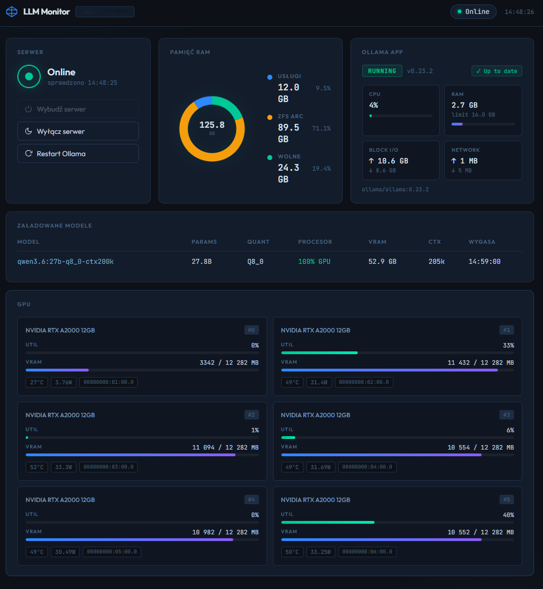

# llm-local-monitor

Dashboard do monitorowania lokalnego serwera LLM opartego na **TrueNAS CE** z kartami GPU i Ollamą.

### Stack docelowy

| Komponent | Rola |
|-----------|------|
| **TrueNAS CE** (`$LLM_HOST`) | Serwer GPU — hostuje Ollamę jako TrueNAS App (Docker container) |
| **Ollama** | Framework do uruchamiania lokalnych modeli LLM (llama, qwen, gemma itp.) |
| **IPMI/BMC** (`$IPMI_HOST`) | Zdalne zarządzanie zasilaniem serwera (wake/shutdown) |
| **Dockge** (`<DOCKGE_HOST>`) | Orchestrator Docker — tu działa ten monitor |

Monitor działa jako kontener Docker na maszynie z Dockge i odpytuje serwer GPU przez SSH.



## Panele

| Panel | Co pokazuje | Źródło danych |
|-------|-------------|---------------|
| **Serwer** | Alive/Offline + Wake/Wyłącz/Restart Ollama | TCP probe, IPMI |
| **Pamięć RAM** | Free / ZFS ARC / Usługi (wykres kołowy) | SSH → `/proc/meminfo` + ZFS arcstats |
| **Ollama App** | Status, CPU%, RAM, Block I/O, Network | SSH → cgroup `/sys/fs/cgroup/docker/<id>/` + `midclt` |
| **Załadowane modele** | Model, rozmiar, quant, GPU/CPU split, context | Ollama REST API `:11434/api/ps` |
| **GPU** | Util%, VRAM, temp, moc (6× RTX A2000) | SSH → `nvidia-smi` |

---

## Dlaczego SSH, nie TrueNAS API?

Dane takie jak cgroup (CPU%/RAM kontenera), `nvidia-smi` (GPU) i `/proc/meminfo` (ZFS) żyją bezpośrednio w systemie plików hosta TrueNAS — nie są dostępne przez REST API. SSH daje dostęp do wszystkiego przez jeden mechanizm auth.

---

## Wymagania wstępne

- Dockge (`http://<DOCKGE_HOST>:5001`)
- Dostęp do TrueNAS UI na serwerze GPU
- Znasz hasło IPMI serwera (BMC `$IPMI_HOST`)

---

## Uruchomienie w Dockge — krok po kroku

### Krok 1 — Klucz SSH: wygeneruj i autoryzuj na serwerze GPU

Kontener potrzebuje klucza SSH żeby łączyć się z `truenas_admin@$LLM_HOST`.
Wykonaj poniższe z terminala (Linux / macOS / WSL).

**1a. Sprawdź czy masz już klucz:**

```bash
ls ~/.ssh/id_ed25519
```

Jeśli plik istnieje — przejdź do kroku 1b.  
Jeśli nie — wygeneruj nowy:

```bash
ssh-keygen -t ed25519 -f ~/.ssh/id_ed25519 -N ""
```

**1b. Dodaj klucz publiczny do konta `truenas_admin` w TrueNAS:**

```bash
cat ~/.ssh/id_ed25519.pub
```

Skopiuj wynik, a następnie w **TrueNAS UI**:  
`Credentials → Local Users → truenas_admin → Edit → SSH Public Keys → wklej → Save`

**1c. Zweryfikuj że działa:**

```bash
ssh -o BatchMode=yes truenas_admin@<LLM_HOST> "echo OK"
```

Powinno odpowiedzieć `OK` bez pytania o hasło.

**1d. Zakoduj klucz prywatny do base64:**

```bash
cat ~/.ssh/id_ed25519 | base64 -w 0
```

Skopiuj cały wynik (długi ciąg, jedna linia) — to będzie wartość `SSH_PRIVATE_KEY_B64`.

> **Dlaczego base64?** Kontener Docker nie ma dostępu do Twoich plików.
> Kodujemy klucz do jednolinijkowego tekstu, przekazujemy przez `.env`,
> a `entrypoint.sh` przy starcie kontenera dekoduje go z powrotem do pliku `/root/.ssh/id_ed25519`.

---

### Krok 2 — Otwórz Dockge

`http://<DOCKGE_HOST>:5001` → kliknij **`+`** (New Stack) → nazwa: `llm-local-monitor`

---

### Krok 3 — Wklej YAML

```yaml
services:
  llm-local-monitor:
    build:
      context: https://github.com/george7979/llm-local-monitor.git#main
      dockerfile: Dockerfile
      no_cache: true
    pull_policy: build
    container_name: llm-local-monitor
    restart: unless-stopped
    ports:
      - "${HOST_PORT:-3788}:3000"
    env_file:
      - .env
```

---

### Krok 4 — Uzupełnij `.env` w Dockge

```env
LLM_HOST=<IP serwera GPU>
LLM_USER=truenas_admin
SSH_PRIVATE_KEY_B64=<wynik z Kroku 1>

IPMI_HOST=<IP modułu BMC>
IPMI_USER=ADMIN
IPMI_PASS=<hasło IPMI>

HOST_PORT=3788
PORT=3000
TZ=Europe/Warsaw
```

---

### Krok 5 — Deploy

Kliknij **Deploy**. Pierwsze uruchomienie zajmie kilka minut (pobieranie obrazu + build).

Dashboard dostępny pod `http://<DOCKGE_HOST>:3788`.

---

## Aktualizacja po zmianach w kodzie

W Dockge: **Restart** stacka — `no_cache: true` + `pull_policy: build` automatycznie pobierze
najnowszy kod z GitHub i przebuduje obraz.

---

## Dokumentacja techniczna

| Plik | Treść |
|------|-------|
| `docs/PRD.md` | Wymagania biznesowe |
| `docs/PLAN.md` | Status i backlog |
| `docs/TECH.md` | Architektura, komendy, troubleshooting |

---

## Metodyka dokumentacji

Projekt używa metodyki **Context Keeper Method (CKM)** do zarządzania dokumentacją:
`docs/PRD.md` (CO i DLACZEGO) · `docs/PLAN.md` (KIEDY) · `docs/TECH.md` (JAK)

→ [github.com/george7979/context-keeper-method](https://github.com/george7979/context-keeper-method)

---

MIT License
