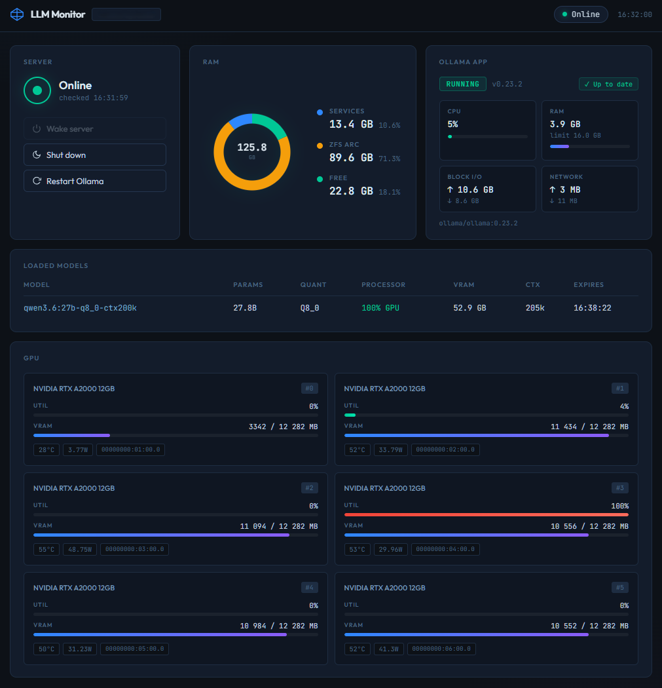

# llm-local-monitor

Dashboard for monitoring a local LLM server running **TrueNAS CE** with GPU cards and Ollama.

### Target stack

| Component | Role |
|-----------|------|
| **TrueNAS CE** (`$LLM_HOST`) | GPU server — hosts Ollama as a TrueNAS App (Docker container) |
| **Ollama** | Framework for running local LLM models (llama, qwen, gemma, etc.) |
| **IPMI/BMC** (`$IPMI_HOST`) | Remote power management (wake/shutdown) |
| **Dockge** (`<DOCKGE_HOST>`) | Docker orchestrator — this monitor runs here |

The monitor runs as a Docker container on the Dockge host and queries the GPU server over SSH.



## Panels

| Panel | Shows | Data source |
|-------|-------|-------------|
| **Server** | Alive/Offline + Wake/Shut down/Restart Ollama | TCP probe, IPMI |
| **RAM** | Free / ZFS ARC / Services (donut chart) | SSH → `/proc/meminfo` + ZFS arcstats |
| **Ollama App** | Status, CPU%, RAM, Block I/O, Network | SSH → cgroup `/sys/fs/cgroup/docker/<id>/` + `midclt` |
| **Loaded models** | Model, size, quant, GPU/CPU split, context | Ollama REST API `:11434/api/ps` |
| **GPU** | Util%, VRAM, temp, power (6× RTX A2000) | SSH → `nvidia-smi` |

---

## Hardware compatibility

Power management (Wake/Shut down) uses **ipmitool with IPMI v2.0** by default (Supermicro and compatible). For other platforms set `WAKE_CMD` / `SLEEP_CMD` in `.env`:

| Hardware | Configuration |
|----------|--------------|
| Supermicro / IPMI v2.0 | ✅ Default — no changes needed |
| IPMI v1.5 | `IPMI_INTERFACE=lan` |
| Dell iDRAC | `WAKE_CMD=racadm ...` |
| HP iLO | `WAKE_CMD=curl ... Redfish API` |

Ready-to-use command examples for each platform are in `.env.example`.

---

## Why SSH and not the TrueNAS API?

Data such as cgroups (container CPU%/RAM), `nvidia-smi` (GPU) and `/proc/meminfo` (ZFS) live directly on the TrueNAS host filesystem — they are not exposed through the REST API. SSH provides access to everything through a single auth mechanism.

---

## Prerequisites

- Dockge (`http://<DOCKGE_HOST>:5001`)
- Access to the TrueNAS UI on the GPU server
- IPMI password for the server (BMC `$IPMI_HOST`)

---

## Running in Dockge — step by step

### Step 1 — SSH key: generate and authorize on the GPU server

The container needs an SSH key to connect to `truenas_admin@$LLM_HOST`.
Run the following from a terminal (Linux / macOS / WSL).

**1a. Check if you already have a key:**

```bash
ls ~/.ssh/id_ed25519
```

If the file exists — skip to step 1b.
If not — generate a new one:

```bash
ssh-keygen -t ed25519 -f ~/.ssh/id_ed25519 -N ""
```

**1b. Add the public key to the `truenas_admin` account in TrueNAS:**

```bash
cat ~/.ssh/id_ed25519.pub
```

Copy the output, then in **TrueNAS UI**:
`Credentials → Local Users → truenas_admin → Edit → SSH Public Keys → paste → Save`

**1c. Verify it works:**

```bash
ssh -o BatchMode=yes truenas_admin@<LLM_HOST> "echo OK"
```

Should respond with `OK` without asking for a password.

**1d. Encode the private key to base64:**

```bash
cat ~/.ssh/id_ed25519 | base64 -w 0
```

Copy the entire output (long string, single line) — this will be the value of `SSH_PRIVATE_KEY_B64`.

> **Why base64?** The Docker container has no access to your local files.
> We encode the key to a single-line string, pass it via `.env`,
> and `entrypoint.sh` decodes it back to `/root/.ssh/id_ed25519` on container start.

---

### Step 2 — Open Dockge

`http://<DOCKGE_HOST>:5001` → click **`+`** (New Stack) → name: `llm-local-monitor`

---

### Step 3 — Paste the YAML

```yaml
services:
  llm-local-monitor:
    build:
      context: https://github.com/george7979/llm-local-monitor.git#main
      dockerfile: Dockerfile
      no_cache: true
    pull_policy: build
    container_name: llm-local-monitor
    restart: unless-stopped
    ports:
      - "${HOST_PORT:-3788}:3000"
    env_file:
      - .env
```

---

### Step 4 — Fill in `.env` in Dockge

```env
LLM_HOST=<GPU server IP>
LLM_USER=truenas_admin
SSH_PRIVATE_KEY_B64=<output from Step 1>

IPMI_HOST=<BMC module IP>
IPMI_USER=ADMIN
IPMI_PASS=<IPMI password>

HOST_PORT=3788
PORT=3000
TZ=Europe/Warsaw
```

---

### Step 5 — Deploy

Click **Deploy**. The first run takes a few minutes (image download + build).

Dashboard available at `http://<DOCKGE_HOST>:3788`.

---

## Updating after code changes

In Dockge: **Restart** the stack — `no_cache: true` + `pull_policy: build` automatically pulls
the latest code from GitHub and rebuilds the image.

---

## Technical documentation

| File | Contents |
|------|----------|
| `docs/PRD.md` | Business requirements |
| `docs/PLAN.md` | Status and backlog |
| `docs/TECH.md` | Architecture, commands, troubleshooting |

---

## Documentation methodology

This project uses the **Context Keeper Method (CKM)** for documentation management:
`docs/PRD.md` (WHAT & WHY) · `docs/PLAN.md` (WHEN) · `docs/TECH.md` (HOW)

→ [github.com/george7979/context-keeper-method](https://github.com/george7979/context-keeper-method)

---

MIT License
